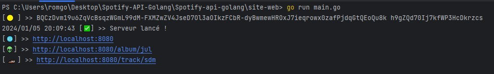
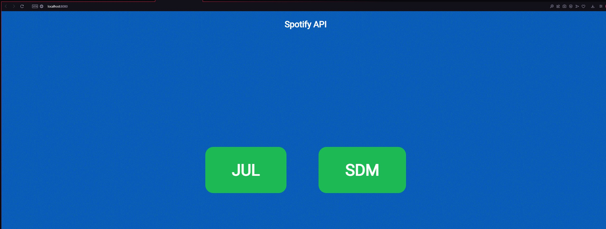
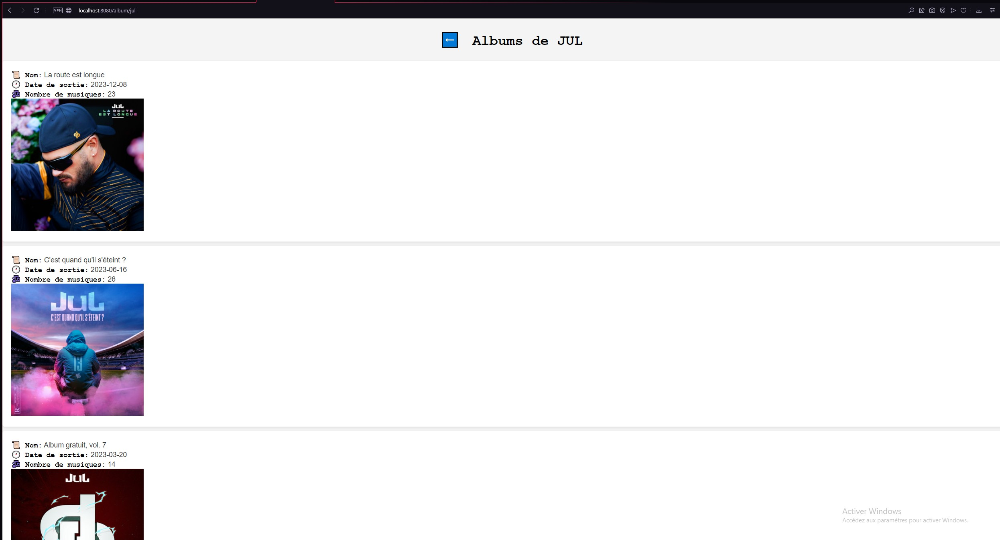
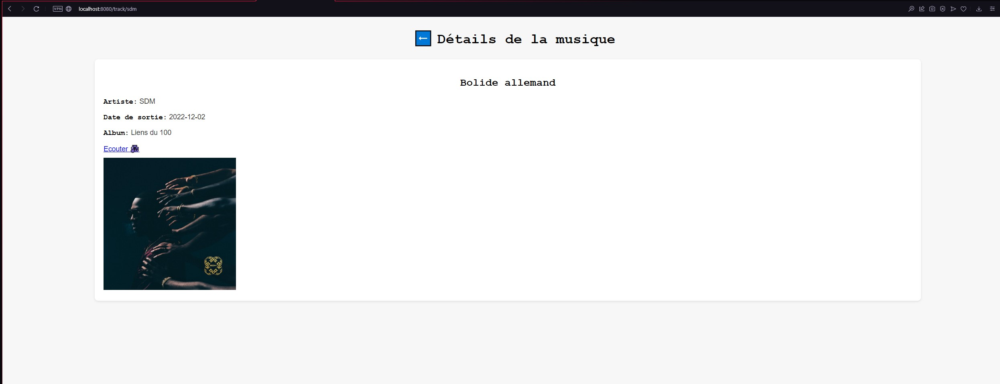
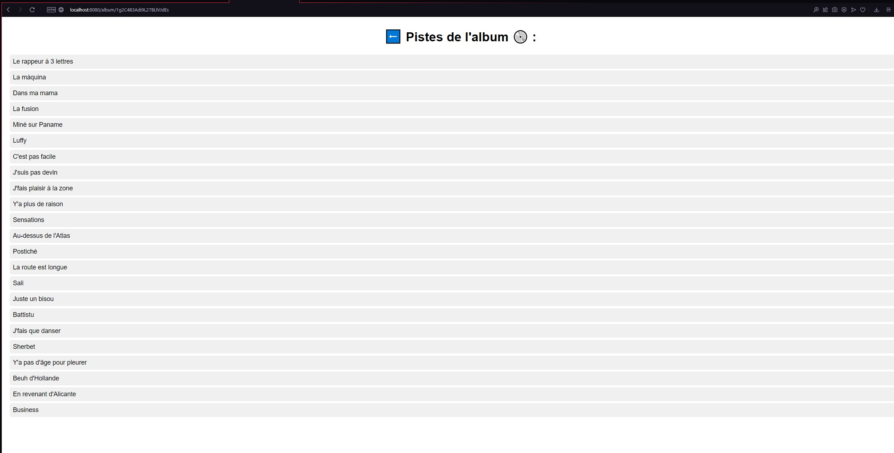

## *Intégration de l'api spotify*

Ce dépôt contient un programme en Go pour interagir avec l'API Spotify afin d'obtenir des informations sur des musiques et des albums.

## Configuration

1) Installation

Clonez ce dépôt :

```git clone https://github.com/votre-utilisateur/spotify-api.git```

2) Lancement du programme

Executez le programme

```go run main.go```



*(Le token d'accès à l'api spotify est automatiquement créé)*

Accédez à l'interface via votre navigateur :

```http://localhost:8080```




3) Routes disponibles

- Accedez à ```http://localhost:8080/album/jul``` pour avoir accès aux albums de JUL



- Accedez à ```http://localhost:8080/track/sdm``` pour avoir accès au morceau "Bolide allemand" de SDM




4) Les tracks de chaque album sont disponibles en cliquant sur ce dernier !


